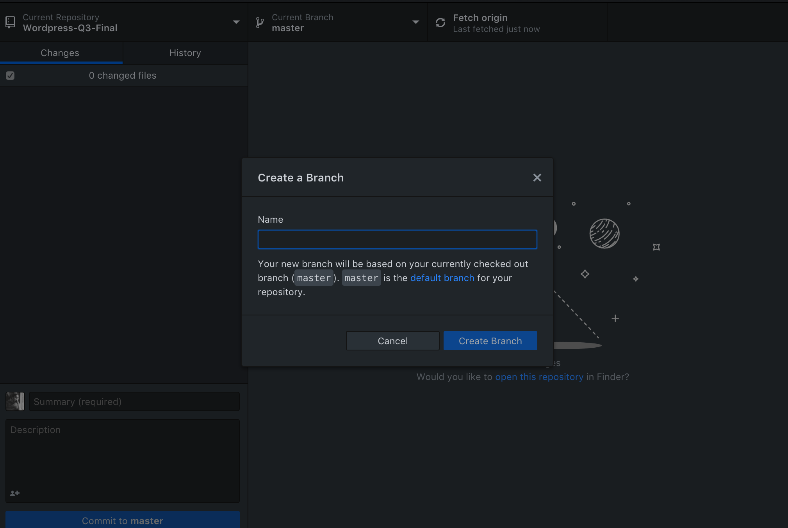
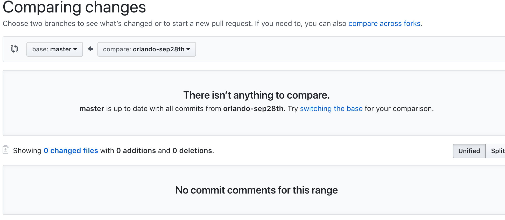



# Class Project

Redesigning the Austin Coding Academy Website.

## Goals
Using everything you know and done you will work together as a class to remake the austin coding academy website with the content that is provided and will improve on it. 

The class will work off a SCRUM board that will be provided by the Professor. This will create a SCRUM based project that most companies use. A git will be used and shared on upgrading the websites code. 

* You will need a git account and be able to use git via a terminal or via a GUI interface like sourcetree. 
* You will be making changes via your local build then pushing them up to the main git repo and creating a pull request to get your changes merged and approved.
* A design will be worked on together via adobe XD

## Proper Use of Git.
When you are working on a code together, many companies use the power of git. This allows teams of developers to work on the same code and not have to worry about running into conflicts. 
1. When you are first creating a workspace. you always want to make a new branch from the MASTER branch. The master branch should not be touched by anyone that isn't the GIT ADMIN

2. When you are working on your branch. I would suggest pushing the changes at the end of the day so the GIT MASTER can know what is going on. 
3. When your changes are ready you have to do a PULL REQUEST a pull request is a check for your changes to the GIT MASTER to check your changes and MERGE them into the master branch bringing the master branch up to par with the most current changes. Make sure your COMPARING your changes to the MASTER BRANCH and not another students or one of your own.

4. Make sure you set the reviewers to be the GIT MASTERS so they can be notified of incoming changes. 
5. When the changes are merged with the master you must do a fresh pull of the master. 

When working with GIT NEVER EVER EVER beautify the files, that will register the entire file as changed and not just the parts you worked on. so this can create merge conflicts

Some tips on proper git work.
[Proper Git Flow](https://www.atlassian.com/git/tutorials/comparing-workflows)
[Git Tutorial](https://www.codecademy.com/learn/learn-git)

### Technical Requirements
* must be editable by the every day user.
* must include 4 email templates (student news, regular newsletter, alumin news, teacher newsleetter)
* Has to include pages that seem relevant
* must be responsive

### Content Requirements
* SEO Needs to be Updated
* import content from existing website (may update where able)
* Email Template can be lipsumed 


