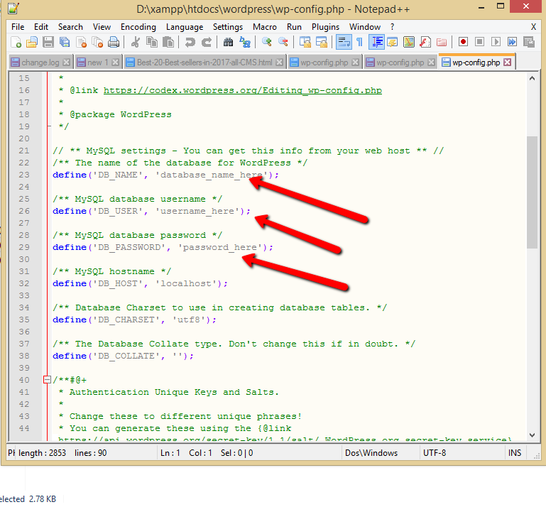



# Lesson Seven - Site Migration

Students Will...
* Understand how to make a successful Wordpress Site Migration

## Key Questions
* How do I move a wordpress build without taking down a website?
* How do I move a sql database from local to live?
* What Plugins Should I use to prepare myself for it?

## Demonstration
Before You Get Started Make Sure you Have
* FTP Login for hosting account
* SQL Login for mySQL server

1. Download and back up the current website, files and sql VIA FTP and the SQL server 
2. Upload the new website to a **NEW** directory on the hosting site. 
3. Export and Migrate your sql database using [WP Migrate DB](https://wordpress.org/plugins/wp-migrate-db/). 
4. set up a new sql database on the sql server.
5. change the sql database info in the wp-config file 

6. add a directory for the old website on the server
7. move the old website into the old director folder
8. move the new website directory contents into the main directory.

The reason for doing it this way is that it flips it on and the old website off. if you uploaded the website while the old website is up it could take down the website for hours depending on the size of the website. 

## If it is a clean install...
A clean install is when nothing has been installed and the domain is brand new. 

1. Upload the website via FTP
2. Upload the SQL database through phpmyadmin
3. If the domain is already assigned the website should appear.
4. If not point the domain and it will appear after a few hours.

## Tips for a Successful Migration 
1. Never do it during the day.(unless your on WP engine)
2. Evening migrations should happen on Thursday or Friday
3. Back up the original locally as well as on the server
4. Know where the website is going - triple check your install, passwords and sql
5. **Delete nothing** from the server just move files
6. Always do a test set up on a sub domain on the clients server cause sometimes servers need to be configured in order to avoid problems.

## Keyterms to look into
1. DNS
2. TTL
3. Hosting
4. A records
5. CNAME
6. Propergation Time
7. SSL

# Project
Buy hosting and set up a website and migrate a website to your hosting. it can be on a sub domain if you already have one.


